<picture> <source media="(prefers-color-scheme: dark)" srcset="assets/hero-dark.svg" />  </picture> 

<a href="https://vibhavy.dev">Portfolio</a>  ·  <a href="https://www.linkedin.com/in/vibhav-yadav/">LinkedIn</a>  ·  <a href="https://leetcode.com/u/vibhav-y/">LeetCode</a>  ·  <a href="https://www.hackerrank.com/profile/vibhavydm">HackerRank</a>  ·  <a href="mailto:vibhavydm@gmail.com">Email</a>

  
I build full-stack products end to end, with a bias toward realtime systems, clean architecture, and interfaces that feel fast. Right now I am building GitTool, an AI-assisted Git client, and exploring distributed systems and Elixir / LiveView.

Selected work
<table> <tr> <td valign="top"><b>Jottr</b></td> <td>A collaborative workspace with CRDT-based realtime sync Next.js · Yjs · Supabase</td> </tr> <tr> <td valign="top"><b>LibraFlow</b></td> <td>A publishing platform with subscriptions and live reader chat React · Node · MongoDB</td> </tr> <tr> <td valign="top"><b>Streamix</b></td> <td>Video streaming with adaptive HLS delivery React · Redis · HLS</td> </tr> <tr> <td valign="top"><b>GitTool</b></td> <td>A desktop Git client with AI-assisted workflows Electron · TypeScript</td> </tr> </table>
Full case studies at <a href="https://vibhavy.dev">vibhavy.dev</a>.

Toolkit
<table> <tr><td><b>Frontend</b></td><td>React · Next.js · Tailwind · Framer Motion</td></tr> <tr><td><b>Backend</b></td><td>Node · Express · Python · Socket.io</td></tr> <tr><td><b>Data</b></td><td>PostgreSQL · MongoDB · Redis · Yjs</td></tr> <tr><td><b>Tooling</b></td><td>Git · Docker · Vercel · Supabase</td></tr> </table>
Writing
How CRDTs Power Real-Time Editing in Jottr
Where Should You Render? A Field Guide to Web Rendering Strategies
Build Log: Shipping LibraFlow to 10,000 Readers
More at <a href="https://vibhavy.dev/blog">vibhavy.dev/blog</a>.

Stats

 <picture> <source media="(prefers-color-scheme: dark)" srcset="https://github-readme-stats.vercel.app/api?username=Vibhav-y&show_icons=true&hide_border=true&bg_color=00000000&title_color=F7790F&text_color=C9C9D1&icon_color=F7790F&include_all_commits=true&count_private=true" />  </picture> <picture> <source media="(prefers-color-scheme: dark)" srcset="https://github-readme-stats.vercel.app/api/top-langs/?username=Vibhav-y&layout=compact&hide_border=true&bg_color=00000000&title_color=F7790F&text_color=C9C9D1&langs_count=8" />  </picture> 
   <picture> <source media="(prefers-color-scheme: dark)" srcset="assets/footer-dark.svg" />  </picture>